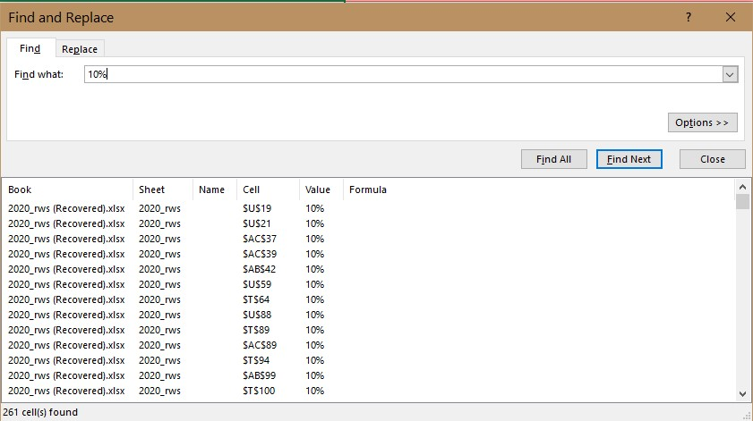
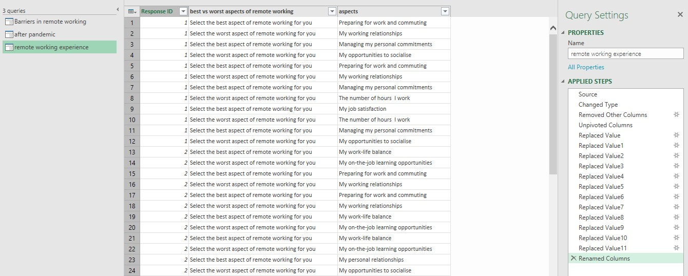
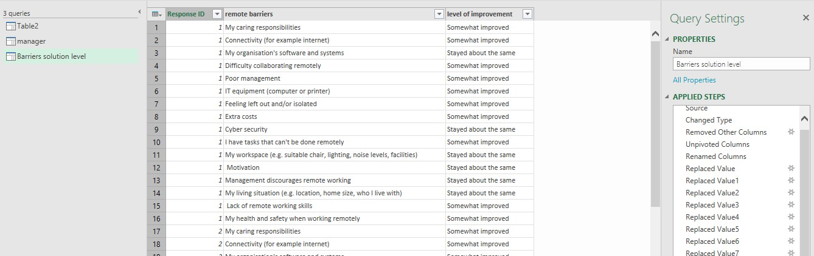
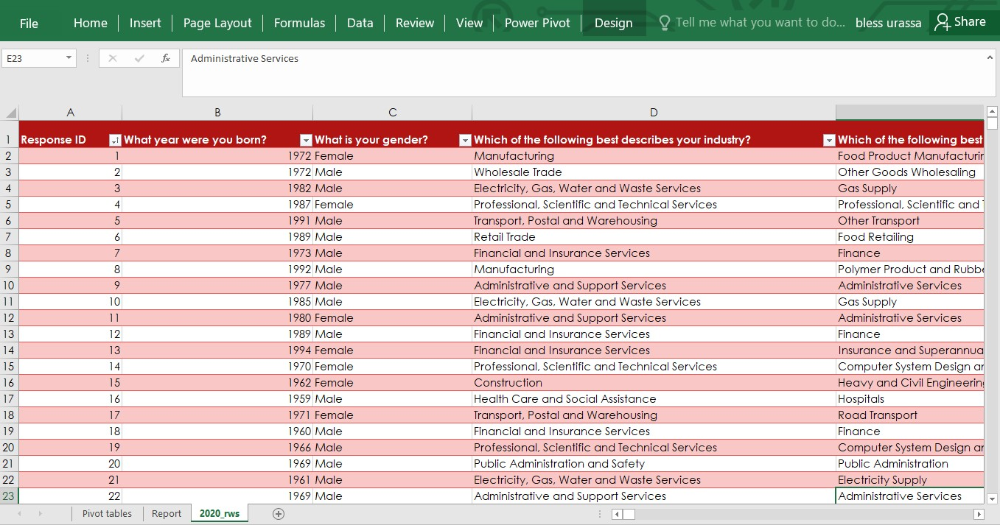
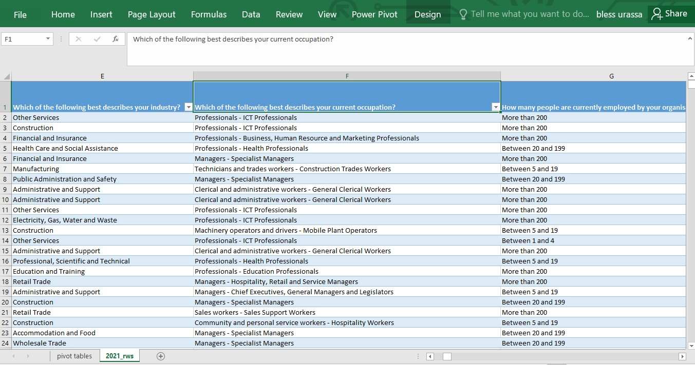
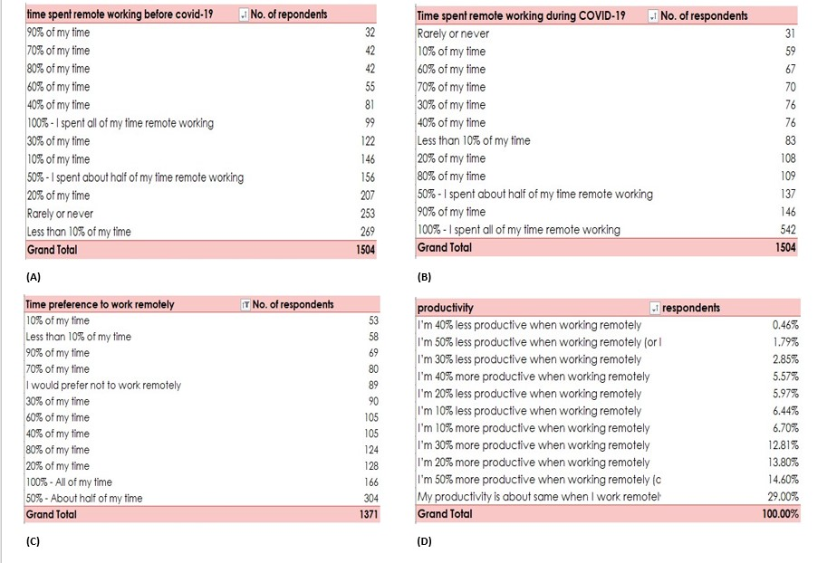
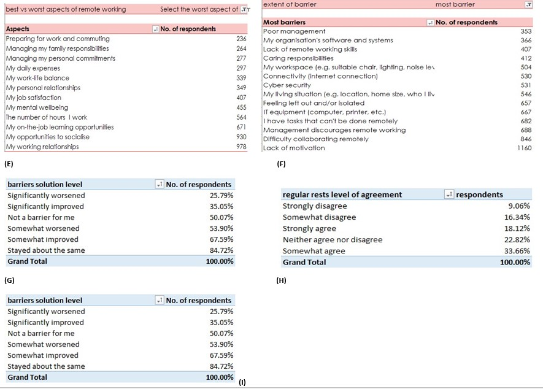
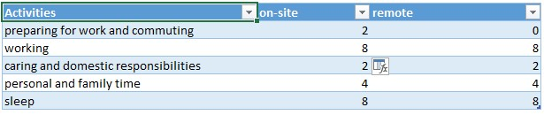
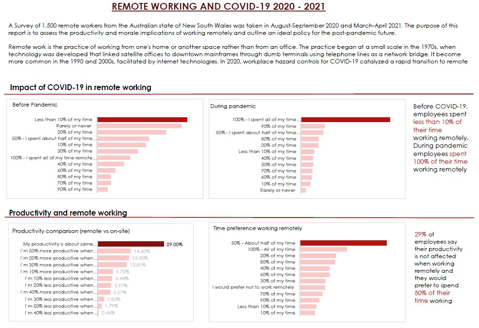
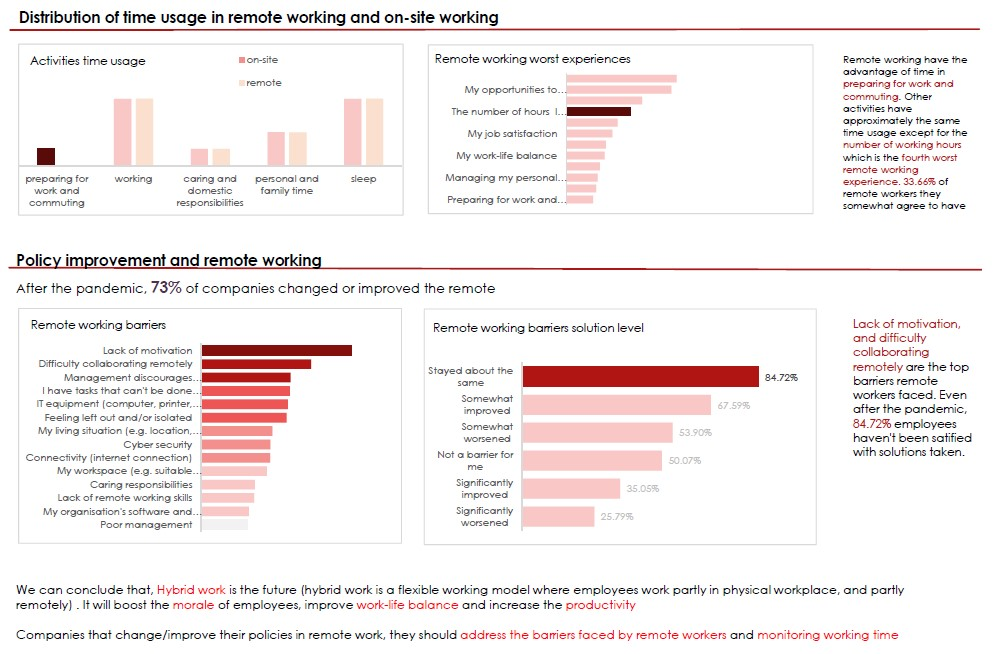

# REMOTE WORK AND COVID-19

---
Remote work is the practice of working from one's home or another space rather than from an office. The practice began at a small scale in the 1970s, when technology was developed that linked satellite offices to downtown mainframes through dumb terminals using telephone lines as a network bridge. It became more common in the 1990s and 2000s, facilitated by internet technologies. In 2020, workplace hazard controls for COVID-19 catalyzed a rapid transition to remote work for white-collar workers around the world, which largely persisted even after restrictions were lifted.

The purpose of this analysis is to assess the productivity and morale implications of working remotely and outline an ideal policy for the post-pandemic future. I used a survey results of 1,500 remote workers from the Australian state of New South Wales, taken in August-September 2020 and March-April 2021. You can access the survey results [here](https://app.mavenanalytics.io/datasets?page=3)

Questions that will help us to understand the productivity, morale of working remotely and a policy for post-pandemic future are as follows;
1.	How has the COVID-19 pandemic impacted the amount of work done remotely? What can be expected post-pandemic?
2.	Does working remotely positively impact productivity? Are there any other benefits?
3.	How does an employees use of time differ when working remotely vs on-site?
4.	What are the biggest barriers to overcome if remote work becomes the norm in the future?

## Understanding Data
The data has two csv files. One is for 2020 which is the year COVID-19 was spreading rapidly and many countries had restrictions concerning public gatherings. It collected data about remote working before and during pandemic and expectations after the pandemic. The second one was for 2021 were restrictions are less tight. It collected data on the last month's of 2020, managers opinions on remote working and others. I can say data in both files were 80% categorical data.

Structure: 
* 2020 - 1507 records and 73 columns
* 2021 - 1512 records and 109 columns

## Data cleaning and Transformation
### Identifying errors and cleaning.
For 2020 data,
Columns M, T, U, AB, and AC had mixed data types that is percentage and general.  
Columns AI, AK, and AM had incorrect data. The 3 columns where asking the amount of time spent doing different activities when your remote working and on-site working. The columns had greater than 24 hours and less than 0 hours of working which is unrealistic. You can't spend 60 or -1 hours working.

For 2021 data, columns J, K, L,M, N, Q, R, and T had mixed data types that is percentage and general. 

All columns with mixed data types were all formated to have same data types using find and replace feature and Incorrect data, records with greater than 24 hours of working were deleted while with -1 was corrected to 1 hour.

**_find and replace_**

### Transformation
The data needs to be changed its structure for easy analysis. Questions that were in multiple choice form they were transformed so as to get number of respondents that choose a certain category from the question. Power query was used to transform the data. Actions done during transformation are removing unwanted columns, unpivoting wanted columns, replace values, and renaming values.

|2020 power query|
|---|
||
---
|2021 power query|
|---|
||
---
Each transformation was purposely made for answering analytical questions. 
Columns transformed in 2020 data are;  
* _Compare remote working to working at your employer’s workplace. Select the best aspect of remote working for you - Managing my family responsibilities ; My working relationships ; Preparing for work and commuting ; The number of hours  I work ; My work-life balance ; My on-the-job learning opportunities_
* _Compare remote working to working at your employer’s workplace. Select the worst aspect of remote working for you - Managing my family responsibilities ; My working relationships ; Preparing for work and commuting ; The number of hours  I work ; My work-life balance ; My on-the-job learning opportunities_
* _From the following, please select the least significant barrier to doing your work remotely - Connectivity (internet connection) ; Feeling left out and/or isolated ; Poor management ; Cyber security ; Lack of motivation ; Lack of motivation_
* _From the following, please select the most significant barrier to doing your work remotely - Connectivity (internet connection) ; Feeling left out and/or isolated ; Poor management ; Cyber security ; Lack of motivation ; Lack of motivation_

Columns transformed in 2021 data are; **Column AX to Column BM**

#### 2020 workbook
#### Click the workbook image to interact

---
#### 2021 workbook
#### Click the workbook image to interact

---

## Analysis
Two types of analysis were carried;

a) **Frequency distribution**. Used to determine the number of observations in each multiple choice. Pivot tables were used to summarise data and get insights

b) **Mode**. Which was used to determine which category appears most frequently in the data. Excel function was used

|Pivot tables|
|---|
||
||

Pivot tables show the following analysis
* (A) Analysis of time spent in remote working before pandemic
* (B) Analysis of time spent in remote working during pandemic
* (c) Analysis of the time employees would prefer to spend working remotely after pandemic
* (D) Comparison of productivity between remote working and on-site working
* (E) Worst experiences faced by employees when remote working
* (F) Barriers faced by remote workers
* (G) Satisfication of solutions taken on barriers
* (H) Analysis of working hours usage
* (I) Change of remote working policies after pandemic

The analysis for distribution of time usage in different activities when remote working and on-site working a function `=MODE('table'!$column1:$column1)` was used.

## Visualization

